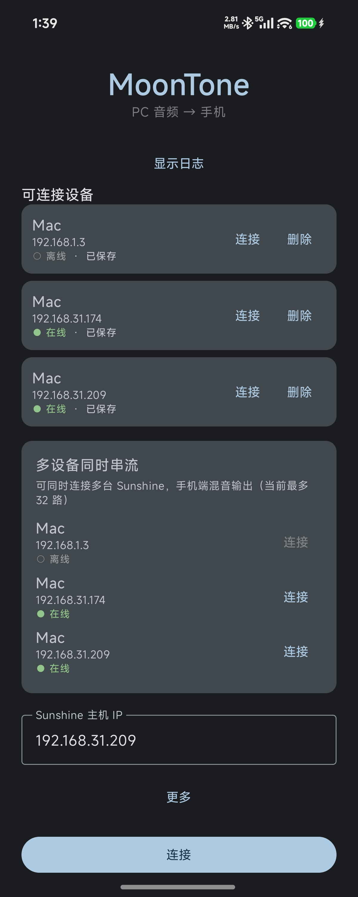
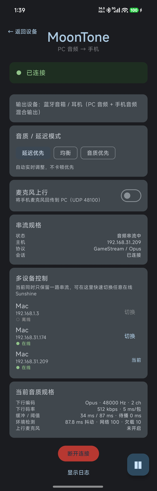

# MoonTone

Stream audio from multiple PCs to your Android phone at the same time, mix it on the phone, and control every device from one panel.

> Pure-audio experience: a tiny dummy video stream keeps the session alive; nothing is shown on screen.
> Multi-device simultaneous streaming: each connection runs in its own Android process, the main process mixes PCM.

## Screenshots

<p align="center">
  
  
</p>

## Features

- Connect to any Sunshine host and play PC audio on your phone
- Connect multiple Sunshine hosts at the same time (currently 32 slots, extendable)
- Mix multiple PCM streams and output through one AudioTrack
- Per-device controls: connect / disconnect / mute / volume
- Auto-reconnect (retries up to 3 times after an unexpected worker disconnect)
- Adaptive quality / latency modes
- Real-time audio spec display
- Microphone uplink (UDP 48100 back to PC)
- Material You dynamic colors

## Architecture

```
Main process: UI / MultiController / AudioMixer / AudioTrack
  ├─ LocalSocket PCM ← Worker :conn1 (PC A)
  ├─ LocalSocket PCM ← Worker :conn2 (PC B)
  └─ ...
```

- Each connection uses an independent `ConnectionWorkerService` process running a Moonlight instance
- The main process receives PCM and mixes it; the Sunshine server needs no changes

See [`docs/MULTI_CONNECTION.md`](docs/MULTI_CONNECTION.md) for details.

## Build

Requirements: Android SDK / NDK.

```bash
cd echolink-app
./gradlew :app:assembleDebug
```

APK output:
```
app/build/outputs/apk/debug/app-debug.apk
```

## Usage

1. Install the APK and open MoonTone.
2. Make sure your phone and PCs are on the same LAN.
3. The app automatically discovers Sunshine hosts via mDNS (`_nvstream._tcp`).
4. In the **Multi-device streaming** panel, tap **Connect** on each PC you want to hear.
5. Once connected, use the per-device controls:
   - **Mute** to silence that PC
   - **Volume** slider to adjust its level
   - **Disconnect** to stop that stream
6. Optional: enable **Microphone uplink** to send the phone microphone back to the currently active PC (UDP 48100).

### Manual connection

If a host is not discovered (e.g. different subnet), enter its IP in the **Sunshine host IP** field and tap **Connect**.

## Tools

```bash
# Connect to a host
python3 tools/moontone_cli.py connect 192.168.31.174

# Status
python3 tools/moontone_cli.py status

# Receive microphone uplink on PC
python3 tools/mic_receiver.py
```

## Sunshine Compatibility

- The client uses `audioOnly=1` + `x-ml-audio-only:1`
- For Sunshine builds that do not support audio-only, a dummy video (`640x480@1fps`) keeps the session alive
- The official macOS prebuilt has a tray thread-safety crash; if you need the tray icon, build from source with the fix (see `SUNSHINE_BUILD.md`)

## Known Issues

- **Multi-device latency is higher than single-device.** To eliminate crackle caused by two independent 48 kHz clocks, each source uses a larger jitter buffer. This increases end-to-end latency when multiple devices are connected. Single-device latency is much lower.
- mDNS discovery does not cross subnets. A host on a different subnet must be added manually by IP.
- The official macOS Sunshine prebuilt crashes on session start due to a tray thread-safety bug; use `system_tray = false` or the source-built version with the tray fix.
- Windows Sunshine may not send video for very small dummy resolutions; the app uses `640x480@1fps` as a compatible dummy stream.

## License

[MIT](LICENSE)

---

# MoonTone

把多台电脑的 Sunshine 音频同时串流到手机，并在手机端混音输出，所有设备在一个面板统一控制。

> 纯音频体验：使用虚拟视频帧保持会话存活，画面不显示。
> 多设备同时串流：每路连接运行在独立 Android 进程，主进程统一混音。

## 截图

<p align="center">
  
  
</p>

## 功能

- 连接任意 Sunshine 主机，播放 PC 音频到手机
- 多设备同时连接（当前 32 路 slot，可扩展）
- 多路 PCM 混音输出
- 每路独立：连接 / 断开 / 静音 / 音量
- 自动重连（Worker 意外断开后重试 3 次）
- 自适应音质 / 延迟模式
- 实时音质规格显示
- 麦克风上行（UDP 48100 回传 PC）
- Material You 动态取色

## 架构

```
主进程：UI / MultiController / AudioMixer / AudioTrack
  ├─ LocalSocket PCM ← Worker :conn1（电脑 A）
  ├─ LocalSocket PCM ← Worker :conn2（电脑 B）
  └─ ...
```

- 每路连接使用独立 `ConnectionWorkerService` 进程运行 Moonlight 实例
- 主进程接收 PCM 并混音，Sunshine 服务端零改动

详细设计见 [`docs/MULTI_CONNECTION.md`](docs/MULTI_CONNECTION.md)。

## 构建

需要 Android SDK / NDK。

```bash
cd echolink-app
./gradlew :app:assembleDebug
```

APK 输出：
```
app/build/outputs/apk/debug/app-debug.apk
```

## 使用说明

1. 安装 APK 并打开 MoonTone。
2. 确保手机和电脑在同一个局域网。
3. App 会自动通过 mDNS（`_nvstream._tcp`）发现 Sunshine 主机。
4. 在“多设备同时串流”面板里，对想听的每台电脑点击“连接”。
5. 连接后可用每台设备的独立控制：
   - “静音”：关闭该路声音
   - “音量”滑块：调节该路音量
   - “断开”：停止该路串流
6. 可选：开启“麦克风上行”，把手机麦克风回传到当前 PC（UDP 48100）。

### 手动连接

如果主机没有被自动发现（例如不同子网），在“Sunshine 主机 IP”里输入 IP，然后点击“连接”。

## 调试工具

```bash
# 连接设备
python3 tools/moontone_cli.py connect 192.168.31.174

# 状态
python3 tools/moontone_cli.py status

# 麦克风上行接收（PC 端）
python3 tools/mic_receiver.py
```

## Sunshine 兼容性

- 客户端使用 `audioOnly=1` + `x-ml-audio-only:1`
- 对不支持 audio-only 的 Sunshine，可使用虚拟视频（`640x480@1fps`）保持会话
- macOS 官方预编译版存在托盘线程崩溃问题，如需托盘请使用源码构建版（见 `SUNSHINE_BUILD.md`）

## 已知问题

- **多设备连接延迟偏大**：为了消除两路独立 48kHz 时钟不同步导致的嘶啦声，每路使用了较大的抖动缓冲，因此多设备同时连接时端到端延迟会比单设备高；单设备延迟明显更低。
- mDNS 发现不跨子网：不同子网的主机需要手动填 IP 连接。
- macOS 官方预编译版 Sunshine 会因托盘线程安全问题在会话启动时崩溃；可设置 `system_tray = false`，或使用带托盘修复的源码构建版。
- Windows Sunshine 对极小虚拟分辨率可能不发送视频；App 使用 `640x480@1fps` 作为兼容虚拟流。

## License

[MIT](LICENSE)
